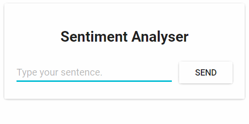
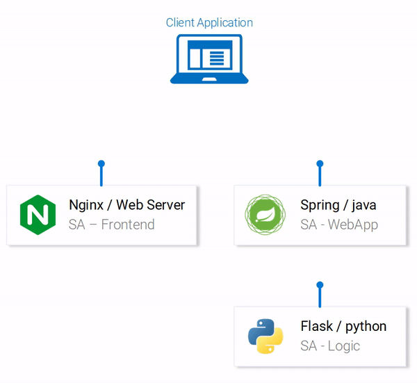

# Introduction

This repository based on series [Kubernetes and everything else](https://rinormaloku.com/series/kubernetes-and-everything-else/) or summarization article in [Learn Kubernetes in Under 3 Hours: A Detailed Guide to Orchestrating Containers](https://medium.freecodecamp.org/learn-kubernetes-in-under-3-hours-a-detailed-guide-to-orchestrating-containers-114ff420e882).

_Series of articles:_
1. [Introduction and Application Architecture](http://web.archive.org/web/20250719135250/https://rinormaloku.com/introduction-application-architecture/)
1. [Setting up the React Application](http://web.archive.org/web/20250809084003/https://rinormaloku.com/setting-up-react-application/)
1. [Setting up the Spring WebApplication](http://web.archive.org/web/20250810133445/https://rinormaloku.com/preparing-spring-webapplication/)
1. [Setting up the Python Application](http://web.archive.org/web/20250810125649/https://rinormaloku.com/setting-up-python-application/)
1. [Container-ization of the Services](http://web.archive.org/web/20250809093853/https://rinormaloku.com/docker-ization-of-the-services/)
1. [Container-ization of everything else](http://web.archive.org/web/20250809083900/https://rinormaloku.com/container-izing-everything-else/)
1. [Introduction to Kubernetes](http://web.archive.org/web/20250618152202/https://rinormaloku.com/introduction-to-kubernetes/)
1. [Kubernetes in Practice – Pods](http://web.archive.org/web/20250719142205/https://rinormaloku.com/kubernetes-practice-pods/)
1. [Kubernetes in Practice – Services](http://web.archive.org/web/20250809091304/https://rinormaloku.com/kubernetes-in-practice-services/)
1. [Kubernetes in Practice – Deployments](http://web.archive.org/web/20250719153719/https://rinormaloku.com/kubernetes-in-practice-deployments/)
    - In this article mentioned `--record` flag which is already deprecated, therefore provided [a link on docs](https://kubernetes.io/docs/concepts/workloads/controllers/deployment/) where you can find a work-around like an `annotate` option
1. [Kubernetes and everything else in Practice](http://web.archive.org/web/20250719143037/https://rinormaloku.com/kubernetes-everything-else-practice/)
1. [Kubernetes Volumes – in Practice](http://web.archive.org/web/20250719134853/https://rinormaloku.com/kubernetes-volumes-in-practice/)

_Another cool article, as an appendix to the main series, about adding Ingress to our architecture:_
- [Ingress Controller - simplified routing in Kubernetes](http://web.archive.org/web/20230604164824/https://www.orange-networks.com/blogs/210-ingress-controller-simplified-routing-in-kubernetes)

_Also faced an article, from the same author, about CronJob which creates Postgres backups. It will be useful to try it by myself:_
- [Back up databases using Kubernetes CronJobs](http://web.archive.org/web/20230604181920/https://www.orange-networks.com/blogs/208-back-up-databases-using-kubernetes-cronjobs)

# Demo

Our application has one functionality, it takes one sentence as input and using Text Analysis calculates the emotion of
the sentence.

From the technical perspective, three parts compose the application where each has a specific functionality:
* **React JS** deals with presenting information to the user and making requests to the Spring Web App.
* **Spring Web App** forwards requests to the python flask application. (IRL Spring would contain features like authorizing users, registration etc.)
* **Python Flask** application that performs the Sentiment Analysis.

# Architecture and Common Data Flow

Three microservices compose the Base Architecture:
* **SA-Frontend** – nginx web server hosting reactjs static files.
* **SA-WebApp** – spring web application for handling user requests.
* **SA-Logic** – flask python application for sentiment analysis.

This interaction is best illustrated by showing how the data flows between them:

1. Client application requests index.html (which in turn requests bundled scripts of ReactJS application)
1. ReactJS makes requests to the Spring WebApp.
1. Spring WebApp forwards the requests for sentiment analysis to the Python app.
1. Python App returns the response.
1. Spring app returns the response to the React App. (Which then represents the information to the user)

